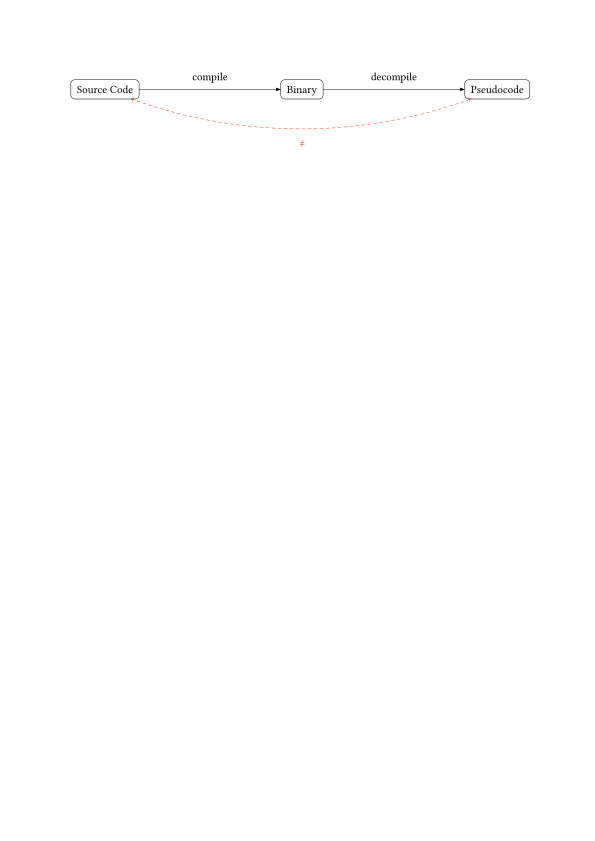
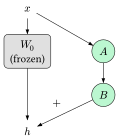
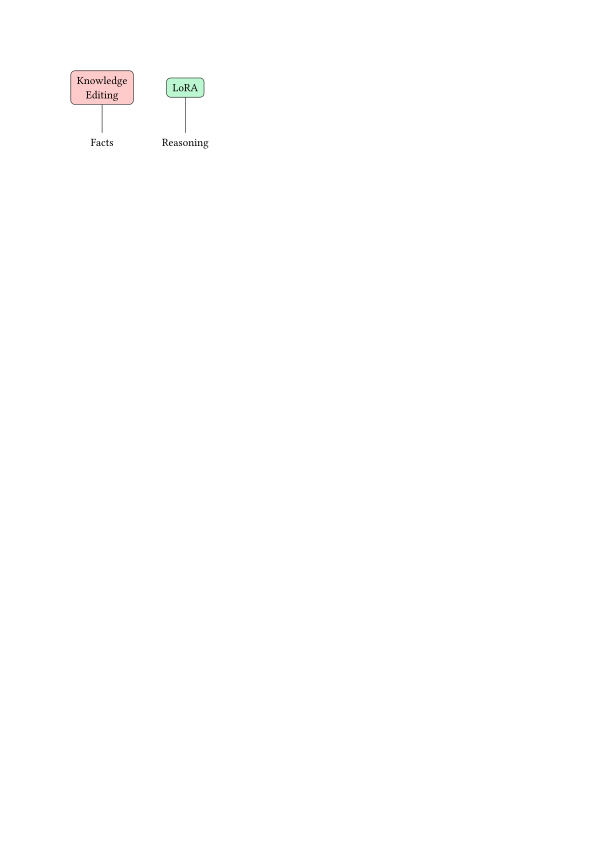
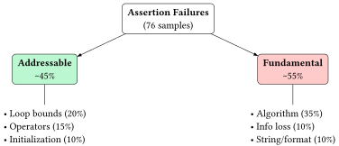

# RevBench

RevBench is the code and data pipeline for my bachelor's thesis, *Comparison of LoRA and Knowledge Editing for Improving Neural Decompilation*, submitted at Heidelberg University in January 2026.

> **Core Research Insight:** This work identifies a critical **syntactic-semantic gap** in neural decompilation: while LoRA fine-tuning effectively fixes syntax (improving compile rates by 4.5x), it struggles to bridge the semantic gap where errors are rooted in reasoning rather than factual knowledge. This explains why Knowledge Editing (ROME) fails where LoRA succeeds.

The goal is to take the pseudocode that Ghidra produces from a compiled binary and turn it into valid, compilable C code using a large language model.

## About the thesis

Compilation throws information away. Variable names, types, comments and a lot of the original control flow do not survive it. A decompiler like Ghidra can recover a rough C-like reading of a binary, but the output is a reading aid, not working code. This matters for security analysis, malware research and legacy software maintenance, where you often want something you can compile, patch and run again.



Language models are a natural fit for this, but an untuned model mostly copies the decompiler's own idioms back at you instead of translating them. The thesis asks how far cheap adaptation methods can get you, and compares two of them that work in very different ways:

- **LoRA (Low-Rank Adaptation)** trains small adapter matrices while the base model stays frozen. Only about 2.3% of the model's parameters are trained. It is a broad, data driven adjustment.
  
- **Knowledge Editing (ROME)** directly modifies a small set of weights to correct individual errors. It treats a mistake as a wrong fact that can be patched.
  

The research questions were:
1. How much does LoRA fine-tuning improve the functional correctness of generated decompiled code?
2. Can knowledge editing fix systematic decompiler artifacts?
3. Which decompilation errors are addressable through model adaptation, and which are not?
4. How does error specific training compare to general fine-tuning?

The evaluation deliberately does not use text similarity metrics like BLEU. Two functions can be written completely differently and still do the same thing, so every generated function is compiled and run against a test harness instead. A sample only counts as correct if it actually behaves like the original.

For context, LLM4Decompile reaches 36.71% with full fine-tuning of a 6.7B model on billions of tokens. The mixed LoRA setup here gets to 28.08% with about 4,000 training samples, so roughly 76% of that performance for orders of magnitude less data.

The full write-up is in `thesis/thesis.pdf`.

## Results

Evaluated on 151 C functions from HumanEval-Decompile. Generation uses nucleus sampling (temperature 0.2, top-p 0.95), so results vary between runs; unless noted otherwise, every number below is the mean of 5 runs with its standard deviation. **Pass@1** means the generated code compiles *and* passes its test harness. **Compile rate** means it only compiles.

| Model | Pass@1 | Compile rate |
|---|---|---|
| CodeLlama-7b-Instruct baseline | 15.50% ± 1.08 | 18.94% ± 0.53 |
| Targeted LoRA (synthetic errors only) | 20.13% ± 0.32 | 21.06% ± 0.26 |
| General LoRA (r=64, alpha=64) | 23.95% ± 1.35 | 84.33% ± 1.19 |
| **Mixed LoRA (general + error specific)** | **28.08% ± 1.30** | 64.50% ± 1.54 |

Main takeaways:
- General LoRA raises the compile rate by 4.5x. Syntax is the easy part.
- Functional correctness improves much less, so a high compile rate does not mean the code is right. The thesis calls this the **syntactic-semantic gap**.
- Training only on synthetic error examples teaches error correction (+4.63 points) but never teaches the model what real Ghidra output looks like, so the compile rate stays near baseline.
- Mixing the two gives the best Pass@1 but costs compile rate. Optimizing for semantics and optimizing for syntax appear to pull against each other.

### LoRA rank sweep

Rank controls how much capacity the adapter has. Even the smallest setting fixes most of the syntax problem, and Pass@1 flattens out past rank 32.

| Rank / alpha | Pass@1 | Compile rate |
|---|---|---|
| 8 / 8 | 20.93% ± 0.79 | 82.38% ± 0.32 |
| 16 / 16 | 21.46% ± 2.03 | 82.91% ± 1.59 |
| 32 / 32 | 23.44% ± 1.60 | 84.77% ± 0.59 |
| 32 / 64 | 23.71% ± 1.84 | 83.97% ± 0.77 |
| **64 / 64** | **23.95% ± 1.35** | 84.33% ± 1.19 |
| 64 / 128 | 22.78% ± 0.90 | **85.56% ± 1.59** |
| 128 / 128 | 23.18% ± 2.09 | 84.50% ± 0.99 |

r=64/alpha=64 was used for everything downstream.

### Knowledge editing

Four ROME edits on the base model, mapping `undefined4` → `int`, `undefined1` → `char`, `undefined8` → `long`, and one targeting `_LC0` string references. Two runs rather than five, because the result was flat.

| Model | Pass@1 | Compile rate |
|---|---|---|
| Baseline | 15.50% ± 1.08 | 18.94% ± 0.53 |
| ROME-edited | 15.23% ± 0.66 | 22.19% ± 0.99 |

Pass@1 does not move; the small compile rate bump is within the noise of a 2-run comparison. None of the four edits produced a correct factual response afterwards either.

### Where the failures come from

Running each sample 5 times splits the 151 test functions into three groups: 20 always pass (13.2%), 99 always fail (65.6%), and 32 are flaky (21.2%): they pass in some runs and fail in others. Flakiness that high is itself a finding, because single-run numbers would misrepresent the model.

Of the 99 consistent failures, 76 compile but fail their assertions, 22 fail to compile, and 1 times out. Manually categorizing those 76 assertion failures gives the error taxonomy:



| Addressable (~45%) | | Fundamental (~55%) | |
|---|---|---|---|
| Loop bound / off-by-one errors | 20% | Algorithm re-interpretation | 35% |
| Comparison operator errors | 15% | Decompiler information loss | 10% |
| Variable initialization errors | 10% | String / format handling | 10% |

The left column is systematic and can be targeted with training data. The right column mostly cannot. The largest single category, algorithm re-interpretation, is where the pseudocode admits more than one reasonable reading and the model picks a plausible one that the test harness does not accept. Information loss is the smaller case where Ghidra emitted a stub and the logic is simply gone.


## Setup

The project targets Python 3.13 and AMD GPUs through ROCm. There is a Nix flake that provides Python, uv, gcc, clang, Ghidra, cmake and the ROCm toolchain:

```bash
# 1. Set up environment
nix develop
# or
uv sync && source .venv/bin/activate
```

The shell hook runs `uv sync` and activates `.venv`. Without Nix, you need `uv`, a C compiler, and Ghidra with `ghidra-analyzeHeadless` on your `PATH`, then:

```bash
uv sync
source .venv/bin/activate
```

The flake sets `PYTORCH_ROCM_ARCH` to `gfx1030` and `HSA_OVERRIDE_GFX_VERSION` to `10.3.0`. Change those if your card differs.

The reported training runs were not done on this local ROCm setup. Most ran on Google Colab with a single NVIDIA A100 (40GB), and some on the bwHPC cluster on nodes with four H100s.

Datasets and model checkpoints live in `data/` and `models/`, neither of which is tracked in git.

## Layout

```
src/          pipeline scripts (data prep, training, evaluation, analysis)
notebooks/    marimo and Jupyter versions of the training and KE experiments
thesis/       thesis source (Typst) and compiled PDF
```

## Pipeline

### 1. Build the training data

Both scripts compile C sources with `gcc -O2`, run Ghidra headless over the object files, and write `{"input": pseudocode, "output": source}` pairs to JSONL. `-O2` is used because it is what production software is built with; it puts real compiler transformations (inlining, loop unrolling, strength reduction) into the binary without being as hostile as `-O3`.

```bash
python src/process_exebench.py     # ExeBench, used for the main training set
python src/process_anghabench.py   # AnghaBench, alternative source
```

Pairs are then filtered on line length and on the length ratio between pseudocode and source, which drops decompilation failures and malformed samples. About 4,000 samples survive.

`src/ghidra_export.py` and `src/ghidra_extract.py` are Ghidra scripts. They run inside Ghidra's Jython interpreter, not in the project venv. Do not run them directly.

### 2. Build the evaluation set

```bash
python src/prepare_humaneval.py
```

This takes the 151 C samples from HumanEval-Decompile, compiles them, decompiles them with Ghidra, and stores the pseudocode together with the test harness and the ground truth in `data/humaneval_c_test.jsonl`.

### 3. Train

Three variants of the same training run:

```bash
python src/train.py            # transformers + peft + trl, QLoRA on one GPU
python src/train_multigpu.py   # same, with bf16 and flash attention for multi GPU
python src/train_unsloth.py    # Unsloth, used for the reported results
```

They all load `data/training_data.jsonl`, apply the CodeLlama `[INST]` prompt template, and save the adapter to `models/final_lora`. Rank, alpha and the other hyperparameters are set at the top of each file. Rename or move the adapter between runs, since all three scripts write to the same path.

The reported configuration: 4-bit base model, LoRA on all attention and MLP projections (`q/k/v/o_proj`, `gate/up/down_proj`), no dropout, effective batch size 16, 2048 token context, 3 epochs, learning rate 2e-4, AdamW 8-bit, seed 3407.

### 4. Evaluate

```bash
python src/eval_pipeline.py --lora models/lora_r64_a64 --output results/r64_a64/00_evaluation_log.jsonl
```

For each test sample the script generates code, glues it together with the test harness, compiles it with gcc, and runs it with a 2 second timeout. Every sample is logged with a status of `PASS` or `FAIL` and one of `Passed`, `Compilation Error`, `Runtime Assertion Failed` or `Timeout`. Leaving out `--lora` evaluates the base model.

Run this 5 times per configuration into `00_evaluation_log.jsonl` through `04_evaluation_log.jsonl`, since a single run is not stable enough to compare.

### 5. Analyze

```bash
python src/analyze-results.py --path results/r64_a64   # mean and stddev per folder
python src/enumerate_failures.py results/r64_a64       # per task failure counts
python src/prepare_analysis_batch.py                   # dump assertion failures for manual review
```

### Error specific training

The second half of the thesis targets the tasks that always fail.

```bash
# collect samples that failed in every run
python src/extract_failures.py --results-dir results/r64_a64 --output data/failures/all_errors.jsonl

# create synthetic training data by injecting Ghidra artifacts and semantic bugs
python src/inject_artifacts.py inject --input data/training_data.jsonl --output data/synthetic.jsonl --semantic

# create a synthetic dataset by combining real failures with synthetic data, oversampling the real ones
python src/inject_artifacts.py combine --real-failures data/failures/all_errors.jsonl --synthetic data/synthetic.jsonl --output data/combined_training.jsonl
```

The synthetic data is rule-based: take clean C and deliberately break it in the ways the model breaks it (`i < n` → `i <= n`, `<` → `>`, strip an initialization), then train on corrupted → correct. It covers 30% of the training set, about 1,200 samples. The mix keeps roughly one error-targeted sample per two general ones.

Training on the combined set gives the best Pass@1 (28.08%) but a lower compile rate (64.50%), which is the trade-off discussed in the thesis.

## Knowledge editing

`codellama-7b-rome.yaml` is the ROME config used with EasyEdit. It edits `model.layers.5.mlp.down_proj` on CodeLlama-7B-Instruct.

```bash
# build edit pairs from ground truth C functions
python src/generate_pmet_dataset.py --input ground_truth_tasks.json --output pmet_synthetic_edits.json

# collect passing samples, used as the reference set for causal tracing
python src/collect_passed_samples.py --eval_dir results/r64_a64 --test_data data/humaneval_c_test.jsonl
```

`ground_truth_tasks.json` is not checked in; it is the set of HumanEval-Decompile tasks with their reference C, dumped from `data/humaneval_c_test.jsonl`.

`src/trace_logic.py` runs a causal trace over the layers of the base model to see which layers carry the prediction. The full experiment is in `notebooks/ke_experiment_nb.ipynb`.

## Thesis

Written in Typst. The compiled PDF is checked in.

```bash
typst compile thesis/thesis.typ
```
